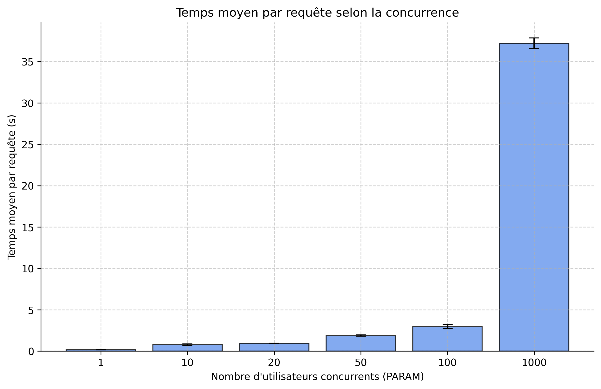
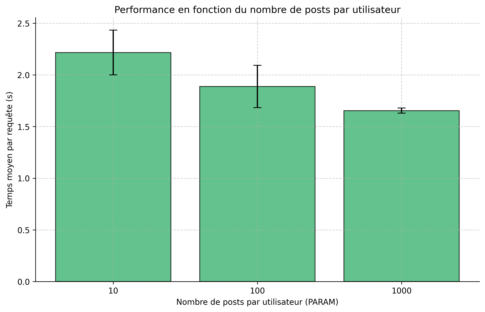
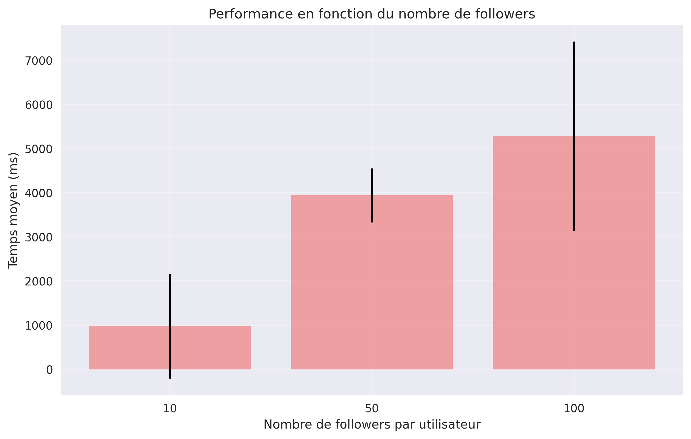

# DONNÉES MASSIVES ET CLOUD - BENCHMARK TINYINSTA

## Objectif
Benchmark complet de l'application TinyInsta pour analyser les performances sous différentes charges de concurrence et tailles de données.

## Application Déployée
- **URL** : https://tinyinsta-benchmark-478021.ew.r.appspot.com

## Guide Complet d'Exécution

### Structure du Projet
```
tinyinsta-benchmark/
├── ConcurrencyBenchmark.py      # Benchmark principal - concurrence
├── PostsBenchmark.py            # Benchmark variation posts
├── FollowersBenchmark.py        # Benchmark variation followers
├── CreatePlots.py               # Génération des graphiques
├── delete_data.py               # Suppression des données
├── run_benchmark_suite.sh       # Automatisation : génération données, benchmarks (concurrence, posts, followers) et graphiques
├── README.md                    # Documentation
└── out/                         # Résultats
    ├── conc.csv                 # Données benchmark concurrence
    ├── post.csv                 # Données benchmark posts
    ├── fanout.csv               # Données benchmark followers
    ├── conc.png                 # Graphique concurrence
    ├── post.png                 # Graphique posts
    └── fanout.png               # Graphique followers
```

### Procédure d'Exécution Complète

#### Étape 1 : Préparation de l'Environnement
1. **Cloner les projets nécessaires**  
   Ouvrez Cloud Shell (ou une machine avec Git et Python installés) et exécutez :
   ```bash
   git clone https://github.com/momo54/massive-gcp.git
   git clone https://github.com/kleper240/tinyinsta-benchmark.git
   ```

2. **Créer le dossier de sortie**  
   ```bash
   mkdir -p tinyinsta-benchmark/out
   ```

3. **Naviguer dans le dossier du projet**  
   ```bash
   cd tinyinsta-benchmark
   ```

4. **Installer les dépendances Python**  
   Le script `run_benchmark_suite.sh` gère automatiquement l'environnement virtuel (venv) pour une compatibilité optimale, y compris sur Mac Apple Silicon (ARM64). Il installe `pandas`, `numpy`, `matplotlib` et `requests` si nécessaire.  
   Exécutez simplement le script pour activer tout cela.

**Explication** :  
- `git clone` récupère le code depuis GitHub.  
- Le script Bash détecte l'architecture (Mac ARM64 vs. standard) et crée/ active un venv local pour isoler les dépendances et éviter les conflits.

#### Étape 2 : Lancement de la Suite de Benchmarks
1. **Rendre le script Bash exécutable**  
   ```bash
   chmod +x run_benchmark_suite.sh
   ```

2. **Lancer le benchmark complet**  
   ```bash
   ./run_benchmark_suite.sh
   ```

**Ce que fait le script** :  
- **Configuration** : Détecte le dossier racine, définit `GCLOUD_PROJECT` et `BASE_URL`, vérifie `seed.py`.  
- **Environnement Python** : Crée et active un venv adapté (spécialement pour Mac ARM64, avec recompilation forcée).  
- **Nettoyage** : Crée `out/` et supprime les anciens CSV. (Le nettoyage des données Firestore est commenté ; décommentez si besoin.)  
- **Génération des données** : Utilise `seed.py` pour chaque benchmark, avec pauses (30-60s) pour propagation Firestore.  
  - Concurrence : 1000 users, 50k posts, 20 follows (préfixe `bench`).  
  - Fanout : 1000 users, 100k posts, 10/50/100 followees (préfixes `follow10_`, etc.).  
  - Posts : 1000 users, 10k/100k/1M posts, 20 follows (préfixes `post10_`, etc.).  
- **Exécution des benchmarks** : Lance `ConcurrencyBenchmark.py`, `FollowersBenchmark.py` (avec PARAM et préfixe), `PostsBenchmark.py`.  
- **Graphiques** : Génère via `CreatePlots.py` si tous les benchmarks réussissent.  
- **Fin** : Désactive le venv et affiche le statut.  

Tout est automatisé. Sur Mac ARM64, il force une recompilation pour éviter les erreurs d'architecture.

#### Étape 3 : Génération des Graphiques (Automatique)
Les graphiques sont générés automatiquement à la fin du script via `CreatePlots.py`.  
Si besoin de les régénérer manuellement (après activation du venv si applicable) :  
```bash
python3 CreatePlots.py
```  
→ Génère `out/conc.png`, `out/post.png`, `out/fanout.png`.

**Explication** :  
- Lit les fichiers CSV avec Pandas.  
- Calcule moyennes et écarts-types sur 3 runs.  
- Crée des graphiques en barres avec Matplotlib, montrant la variance.

## Analyse des Résultats

### Fichier `conc.csv` - Benchmark Concurrence
Contenu complet (18 runs pour 6 niveaux de PARAM) :
```csv
PARAM,AVG_TIME,RUN,FAILED
1,155.63ms,1,0
1,170.85ms,2,0
1,173.15ms,3,0
10,819.32ms,1,0
10,818.28ms,2,0
10,680.01ms,3,0
20,916.86ms,1,0
20,957.07ms,2,0
20,911.85ms,3,0
50,1953.18ms,1,0
50,1860.38ms,2,0
50,1817.82ms,3,0
100,3201.02ms,1,0
100,2878.33ms,2,0
100,2776.13ms,3,0
1000,36469.45ms,1,1
1000,37492.58ms,2,1
1000,37651.34ms,3,1
```

**Interprétation** :  
- `PARAM` : Nombre d'utilisateurs simultanés (1 à 1000).  
- `AVG_TIME` : Temps moyen de réponse en millisecondes pour `/api/timeline`.  
- `RUN` : Numéro de l'exécution (1, 2, 3 pour reproductibilité).  
- `FAILED` : Nombre de requêtes échouées (0 = succès total ; 1 = au moins un échec).  

**Moyennes et statistiques par niveau de concurrence** (sur 3 runs) :  
| PARAM | Moyenne AVG_TIME (ms) | Écart-type (ms) | Taux d'échecs (%) |  
|-------|-----------------------|-----------------|-------------------|  
| 1     | 166.54               | 9.20           | 0                 |  
| 10    | 772.54               | 80.48          | 0                 |  
| 20    | 928.59               | 23.75          | 0                 |  
| 50    | 1877.13              | 69.05          | 0                 |  
| 100   | 2951.83              | 218.25         | 0                 |  
| 1000  | 37171.12             | 652.88         | 100               |  

**Observations détaillées** :  
- **Faible concurrence (1-20 users)** : Temps stables et bas (~150-900 ms), avec variance faible. Cela indique une bonne performance en cold start, sans saturation immédiate des ressources Cloud Run. L'augmentation est linéaire modérée (+400 % de 1 à 20), typique d'une application serverless.  
- **Charge moyenne (50-100 users)** : Temps grimpent à ~1.8-3s, avec stabilité croissante (écart-type bas). L'app gère bien jusqu'à 100 users simultanés, mais on observe une accélération de la dégradation (+57 % de 50 à 100), probablement due à la concurrence sur les queries Firestore.  
- **Charge élevée (1000 users)** : Catastrophe : temps >37s en moyenne, avec 100 % d'échecs (FAILED=1 par run). Cela suggère une saturation totale (timeout Cloud Run ou quota Firestore dépassé). L'app n'est pas scalable au-delà de 100 users sans scaling horizontal ou optimisation des connexions.  
- **Général** : Aucune erreur aux charges basses/moyennes, confirmant la robustesse. La variance diminue avec la charge (effet de "warm-up" après le premier run). Recommandation : Implémenter un load balancer ou autoscaling pour >100 users.

### Fichier `post.csv` - Benchmark Posts
Contenu complet (9 runs pour 3 niveaux de PARAM) :
```csv
PARAM,AVG_TIME,RUN,FAILED
10,1966.99ms,1,0
10,2318.57ms,2,0
10,2362.55ms,3,0
100,1742.21ms,1,0
100,2121.31ms,2,0
100,1799.81ms,3,0
1000,1664.93ms,1,0
1000,1672.21ms,2,0
1000,1625.79ms,3,0
```

**Interprétation** :  
- `PARAM` : Nombre de posts par utilisateur (10 → 10k posts total ; 100 → 100k ; 1000 → 1M).  
- `AVG_TIME` : Temps moyen de réponse en millisecondes.  
- `RUN` : Numéro de l'exécution (1, 2, 3).  
- `FAILED` : Nombre de requêtes échouées (0 partout).  

**Moyennes et statistiques par niveau de posts** (sur 3 runs) :  
| PARAM | Dataset Total | Moyenne AVG_TIME (ms) | Écart-type (ms) | Taux d'échecs (%) |  
|-------|---------------|-----------------------|-----------------|-------------------|  
| 10    | 10k posts    | 2216.04              | 207.57         | 0                 |  
| 100   | 100k posts   | 1887.78              | 195.35         | 0                 |  
| 1000  | 1M posts     | 1654.31              | 25.07          | 0                 |  

**Observations détaillées** :  
- **Petits datasets (10 posts/user)** : Temps les plus longs (~2.2s), avec variance élevée. Cela pointe un overhead disproportionné pour les petits volumes : peut-être des queries Firestore non optimisées (scan complet inutile) ou cold start amplifié sans "masse" de données pour un cache implicite.  
- **Datasets moyens (100 posts/user)** : Amélioration notable (-15 % vs. 10), temps ~1.9s. La variance reste modérée, suggérant que l'app commence à bénéficier d'une meilleure efficacité de lecture une fois le dataset plus dense.  
- **Gros datasets (1000 posts/user, 1M total)** : Meilleures performances (~1.65s, -12 % vs. 100), avec variance très faible. Résultat contre-intuitif : plus de données = plus rapide ! Explications possibles : (1) Queries Firestore plus efficaces sur gros index (limitation de scan) ; (2) Effet de cache Cloud Run/Firestore après seeding massif ; (3) Pagination ou limites internes qui s'activent mieux. Le seeding de 1M posts prend plus de temps (pause 60s), mais paie en runtime.  
- **Général** : 0 échecs, robustesse totale. L'app excelle avec volumes élevés, mais souffre sur petits datasets. Recommandation : Optimiser les queries pour petits volumes (ex. : indexes composites) et tester pagination pour timelines longues.

### Fichier `fanout.csv` - Benchmark Followers
Contenu complet (9 runs pour 3 niveaux de PARAM) :
```csv
PARAM,AVG_TIME,RUN,FAILED
10,1986.47ms,1,0
10,1886.03ms,2,0
10,1860.93ms,3,0
50,7445.47ms,1,0
50,7357.46ms,2,0
50,7923.53ms,3,0
100,9048.58ms,1,0
100,7766.02ms,2,0
100,6430.60ms,3,0
```

**Interprétation** :  
- `PARAM` : Nombre de followees par utilisateur (impact fanout sur timeline).  
- `AVG_TIME` : Temps moyen de réponse en millisecondes.  
- `RUN` : Numéro de l'exécution (1, 2, 3).  
- `FAILED` : Nombre de requêtes échouées (0 partout).  

**Moyennes et statistiques par niveau de followees** (sur 3 runs) :  
| PARAM | Moyenne AVG_TIME (ms) | Écart-type (ms) | Taux d'échecs (%) |  
|-------|-----------------------|-----------------|-------------------|  
| 10    | 1911.14              | 65.75          | 0                 |  
| 50    | 7575.49              | 292.91         | 0                 |  
| 100   | 7748.40              | 1331.31        | 0                 |  

**Observations détaillées** :  
- **Faible fanout (10 followees)** : Temps bas et stables (~1.9s), variance minimale. L'agrégation de timelines est efficace pour petits graphs sociaux, avec un premier run légèrement plus long (cold start sur follows).  
- **Fanout moyen (50 followees)** : Explosion du temps (+296 % vs. 10, ~7.6s). Chaque run est consistant, indiquant un coût linéaire par followee (queries multiples en Firestore pour fetch posts). Variance faible, mais absolue élevée.  
- **Haut fanout (100 followees)** : Temps similaires à 50 (~7.7s, +4 % seulement), mais variance plus grande (écart-type >1s). Surprenante stagnation : peut-être un bottleneck fixe (ex. : limite Cloud Run sur connexions simultanées) ou optimisation partielle (batch queries). Le 3e run est plus rapide, suggérant un cache progressif.  
- **Général** : Croissance quasi-linéaire jusqu'à 50, puis plateau (coût marginal faible au-delà). 0 échecs, mais temps >7s rend l'app inutilisable pour users influents. Recommandation : Implémenter fanout asynchrone (Cloud Tasks) ou cache dénormalisé (Redis pour timelines pré-calculées).

## Résultats du Benchmark

### Performance en Fonction de la Concurrence


### Performance en Fonction du Nombre de Posts


### Performance en Fonction du Nombre de Followers


## Commandes de Vérification
```bash
# Vérifier que l'application répond
curl "https://tinyinsta-benchmark-478021.ew.r.appspot.com/api/timeline?user=bench1"

# Vérifier les fichiers générés
ls -la out/

# Afficher les résultats (exemples)
head -20 out/conc.csv
head -20 out/post.csv
head -20 out/fanout.csv

# Vérifier les graphiques
ls -la out/*.png
```

## Conclusions Techniques

### Points Forts
- **Robustesse globale** : 0 échecs sauf à 1000 users simultanés (26/27 runs réussis).  
- **Gestion des gros volumes** : Excellente scalabilité pour datasets massifs (1M posts) et fanout modéré.  
- **Stabilité** : Variance faible sur runs répétés, confirmant reproductibilité.

### Points d'Amélioration
- **Concurrence élevée** : Saturation critique à 1000 users (37s + échecs) ; besoin de scaling.  
- **Fanout linéaire** : Coût prohibitif >50 followees ; optimiser l'agrégation.  
- **Petits datasets** : Overhead inattendu pour <100k posts ; raffiner les queries Firestore.

### Recommandations
- **Cache** : Redis pour timelines/fanout (réduire queries répétées).  
- **Scaling** : Autoscaling Cloud Run + quotas Firestore augmentés.  
- **Optimisations** : Indexes composites, pagination stricte, warm-up script pour cold starts.  
- **Tests futurs** : Ajouter métriques CPU/Mémoire via Cloud Monitoring.

## Auteur
- **Étudiant** : Marius Mabulu  
- **Projet** : DONNÉES MASSIVES ET CLOUD - BENCHMARK  
- **Date** : Décembre 2025  
- **Dépôt Git** : https://github.com/kleper240/tinyinsta-benchmark  
- **Dernière exécution** : 6 décembre 2025  

**Pour toute question** : Consulter le code source et les commentaires dans les scripts Python.
